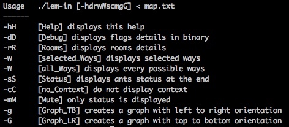

# Lem_in (42 School Project)

Lem-in is an algorithm project, where ants have to go the fastest as posible from start-room to end-room.

Subjects:
* [english](00_Subject/lem-in.en.pdf)
* [french](00_Subject/lem-in.fr.pdf)

## Maps
```
10          // Number of ants
1 250 150   // Name of the room (1) and his XY coordinates
2 550 150
3 550 450
##start     // The next room will be the first one
4 250 450
##end       // The next room will be the last one
5 850 450
6 850 150
1-2         // The room called '1' is linked with the room called '2'
1-3
1-4
2-4
2-6
2-5
3-4
3-5
3-6
5-6
```

## Output

L[ant]-[room]
```
L1-2 L2-3                // Lap 1 : The ant n°1 went to the room called '2'. In the same time, the ant n°2 went to the room called '3'.
L1-5 L3-2 L2-5 L4-3
L3-5 L5-2 L4-5 L6-3
L5-5 L7-2 L6-5 L8-3
L7-5 L9-2 L8-5 L10-3
L9-5 L10-5
```

## Installation

`make`

## Usage



### Option Ways -W
-W option displays every possible ways
* Selected ways are writed in white
* Selected ways are writed in grey


### Option status -s
Displays a status at the end


## Visual
prerequisites: `graphviz`

* `./lem-in -g < [map]` creates a graph with left to right orientation
* `./lem-in -G < [map]` creates a graph with top to bottom orientation


* Blue lines represent ways used by ants
* Grey lines are ignored by ants
